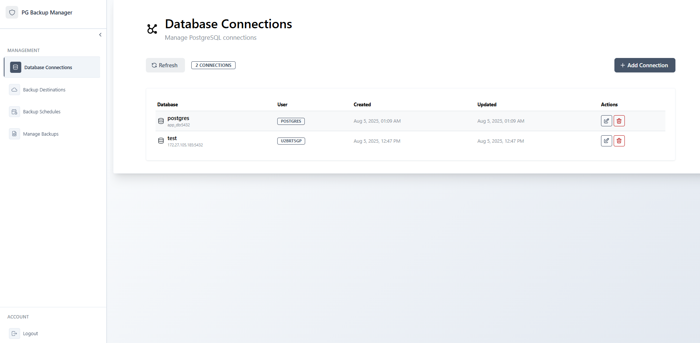
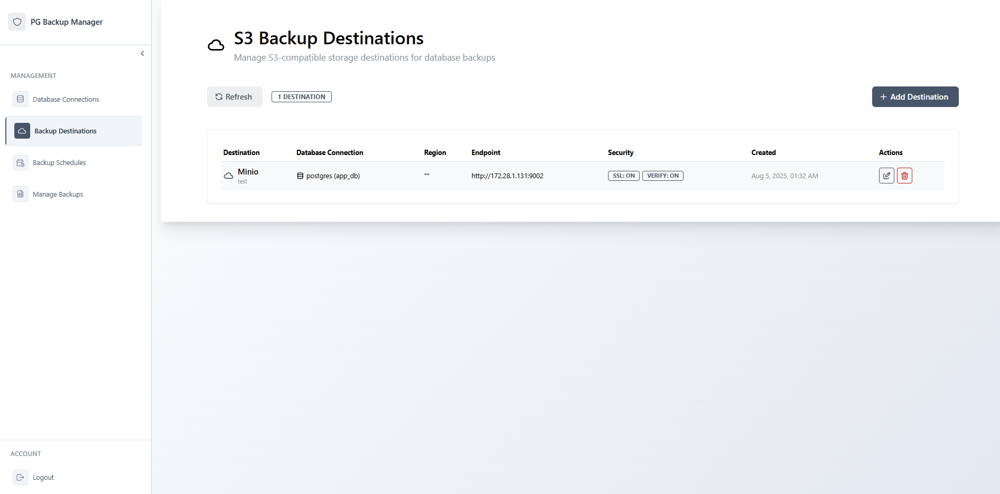
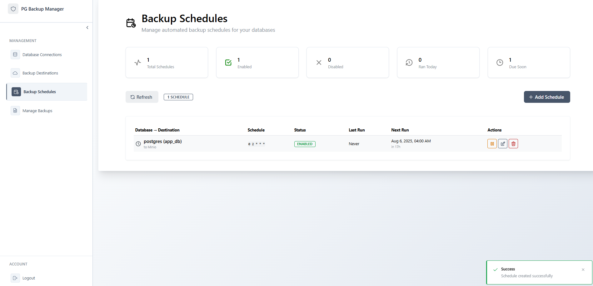
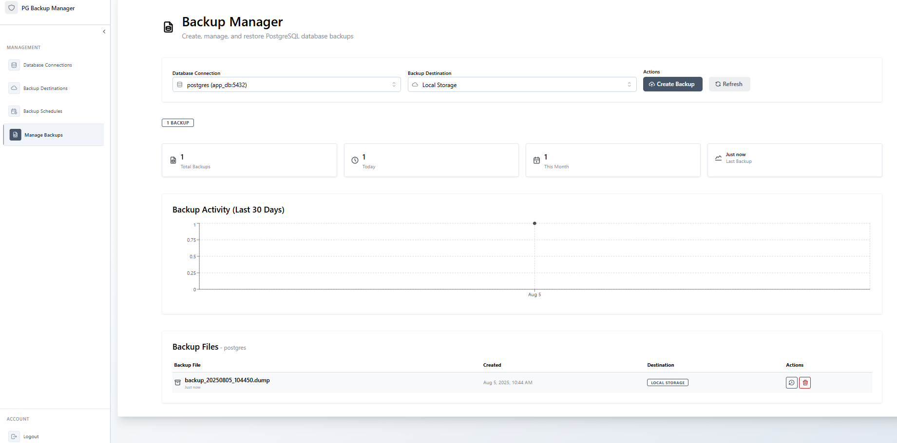

### Postgres Backup Manager
#### Overview
A simple, lightweight application for managing Postgres database backups. You can create backups, store them locally or in an S3-compatible bucket, restore backups, set up periodic backup schedules, and perform other related tasks.

1. Start by connecting to the Postgres database you want to back up.  
   

2. (Optional) Add an S3-compatible destination, such as Minio, for storing backups.  
   

3. (Optional) Set a backup schedule. Scheduled jobs currently support backing up databases to an S3 bucket.  
   

4. You can also create backups manually, restore from backups, or view a list of existing backups.  
   